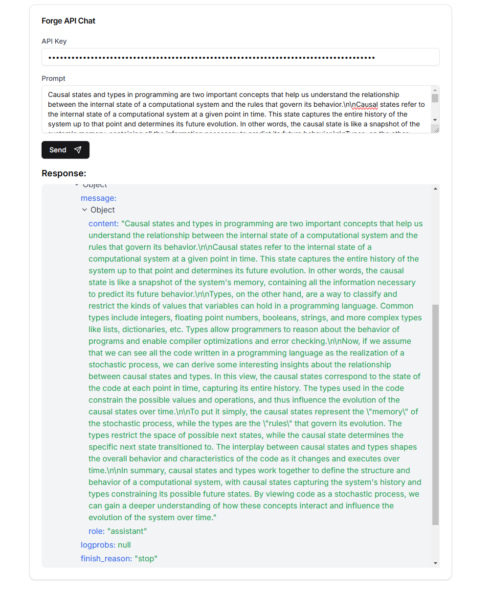

# NousForgeUI

UI for beta endpoint of nousforge - A simple interface to interact with the Nous Research Forge API.



## Features

- Clean, modern interface built with Next.js and Tailwind CSS
- Real-time API interaction with Nous Research Forge
- JSON response viewer with collapsible sections
- Dark/Light mode support
- Responsive design

## Prerequisites

- Node.js 18.x or higher
- npm or yarn package manager
- A valid Forge API key from Nous Research

## Installation

1. Clone the repository:
    ```bash
    git clone https://github.com/yourusername/NousForgeUI.git
    cd NousForgeUI
    ```

2. Install dependencies:
    ```bash
    npm install
    # or
    yarn install
    ```

3. Run the development server:
    ```bash
    npm run dev
    # or
    yarn dev
    ```

4. Open [http://localhost:3000](http://localhost:3000) with your browser to see the application.

## Usage

1. Enter your Forge API key in the designated field
2. Type your prompt in the text area
3. Click "Send" to submit your request
4. View both the formatted response and the full JSON response below


## Development

The project uses:
- Next.js 15.0.3
- React 19.0
- Tailwind CSS for styling
- shadcn/ui components
- TypeScript for type safety

## License

This project is licensed under the MIT License - see the [LICENSE](LICENSE) file for details.


## Acknowledgments

- Built with [Next.js](https://nextjs.org/)
- UI components from [shadcn/ui](https://ui.shadcn.com/)
- API provided by [Nous Research](https://nousresearch.com/)